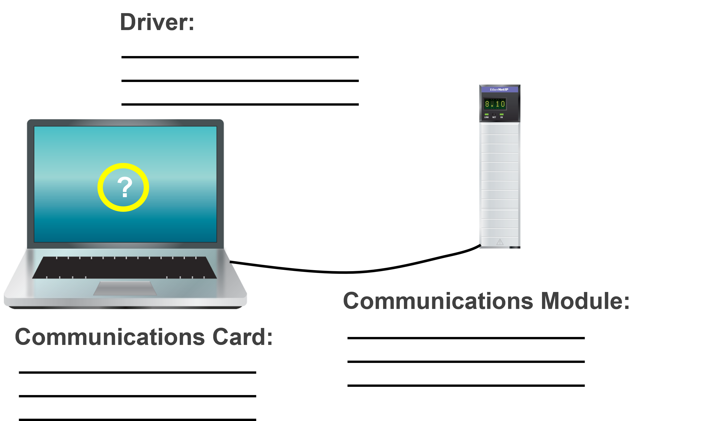
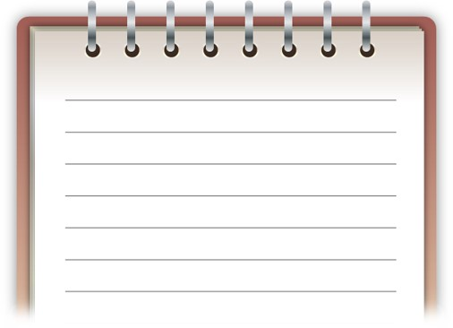
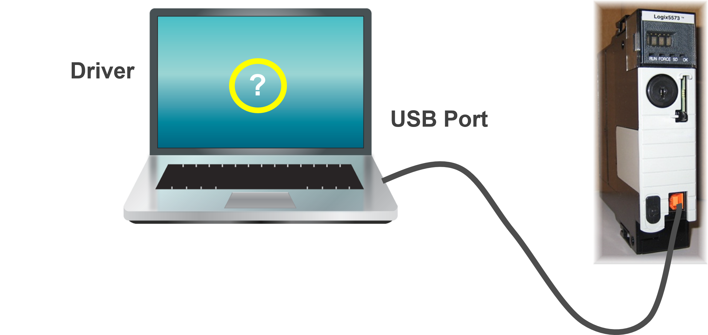
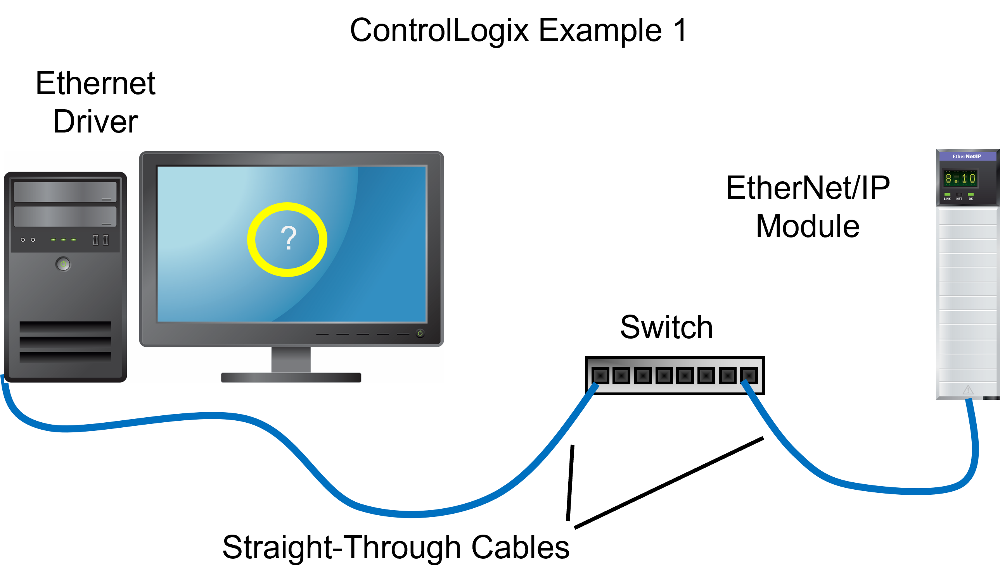
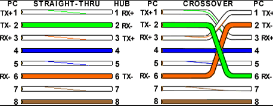
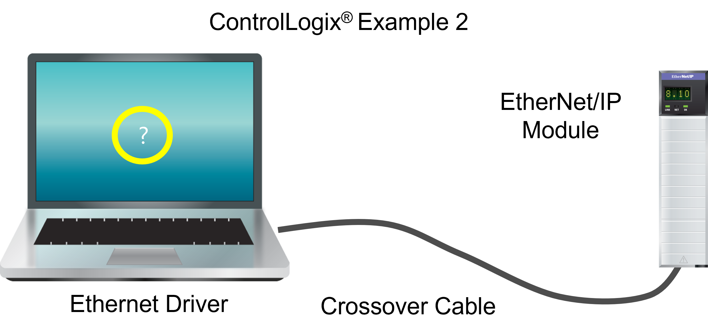
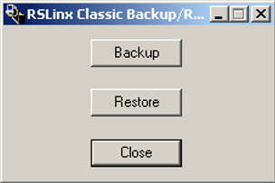

::: rau-slide-overview

## Overview

After completing this lesson, you should be able to:

- Configure a communications driver
- Back up and restore driver configurations

:::

::: rau-slide-importance

## Importance of Skills

These skills are important for the following reasons:

- You may need to configure a communications driver before you transfer a project file to a Logix 5000™ controller:
    - If your plant structure requires maintainers to set up their own monitoring or troubleshooting stations.
    - If you are called into a different plant or scenario where you do not have the setup required to communicate with the system. 
- You may need to back up and restore driver configurations to ensure that commonly used communication drivers can be restored:
    - After a computer hardware failure.
    - After an upgrade to communications software.

:::

::: rau-slide-activity

## Activity

Define the listed terms:

::: notes

The L8x controllers contain an embedded EtherNet/IP™ port, eliminating the need for a separate communications module when communicating on an EtherNet/IP network.

**Answers:**

- Driver: A software configuration that allows a computer to access a specific type of external device, such as a communications card.
- Communications Card: A physical hardware interface that allows a computer to connect to a network.
- Communications Module: Hardware that allows a controller to pass data through a network to a remote device

::: script

This script section is used for the spoken-word dialogue relevant to the content and should remain plain text

:::

:::

:::

::: rau-slide-activity

## Activity

List other types of drivers you are familiar with:

:::

::: rau-slide-plain

## Point-To-Point Connection Overview

To connect directly to a controller using a point-to-point connection, the following setup is required:

 

**ControlLogix® USB Example**

Standard Type-A to Type B USB Cable

(maximum length: 3.0 m (9.84 ft) with no hubs)

::: notes

As a stream of single bits, a point-to-point connection is typically the slowest, but it is the easiest way to connect to a Logix 5000™ system.

:::

:::

::: rau-slide-plain

## EtherNet/IP Connection Overview

 

**To connect to an Ethernet or EtherNet/IP™ communications network, the following setup is required:**

- An appropriate network card must be installed in your computer and configured.
- The network media must be connected to the computer and the destination hardware.
- An Ethernet device or EtherNet/IP driver must be configured in RSLinx® software
- The IP (Internet Protocol) address and subnet mask must be assigned to an adapter or Ethernet module in the same chassis as the controller.
    - For L8x controllers, the IP address can be assigned directly to the embedded Ethernet of the controller.

::: notes

Communications cards, node addresses, and drivers only need to be set up once. After initial setup, you should be able to reconnect the cables at anytime and go online to a controller.

The Ethernet devices driver requires the user to manually enter IP addresses, while the EtherNet/IP driver can be configured to automatically browse for active devices on the configured network of the computer.

:::

:::

::: rau-slide-question

## Question

**When going online to troubleshoot, a driver is required for the communications network. What is a driver?**

a) A driver is the hardware interface that allows a computer to connect to a network.
b) A driver is a file that updates module firmware.
c) A driver is a software configuration that allows a computer to access a specific type of external device to connect to a network.
d) A driver is a device that saves and restores communications configuration information

::: notes

ANSWER:
C

:::

:::

::: rau-slide-plain

## IMPORTANT

Each network requires its own specific setup.

Depending on your company policy, some or all of the steps, such as installing the communications card in the computer, may already be done.

:::

::: rau-slide-example

## Example

**EtherNet/IP™ Communications:**

EtherNet/IP communications to a ControlLogix® system can occur using straight-through or crossover cables:

:::

::: rau-slide-example

## Example

::: columns

::: {.column width="60%"}

Many newer computers, Ethernet switches, and select Rockwell Automation EtherNet/IP™ modules can automatically detect an Ethernet cable as being straight-through or crossover communications, eliminating the need to carry both cable types.

:::

::: {.column width="40%"}

:::

:::

:::

::: rau-slide-plain

## RSLinx Classic Software

**RSLinx® Classic software is required by a Logix 5000™ system to perform the following critical communications-related tasks:**

- Configure communications drivers.
- View configured networks and active nodes.
- Enable communications tasks, such as uploading, downloading, going online, updating firmware, and sending messages.

::: notes

RSLinx Classic software is automatically opened or maximized when any communications option in Studio 5000 Logix Designer® application is activated. 

RSLinx Classic software is available in multiple versions, including: RSLinx Classic Lite, RSLinx Classic Professional, RSLinx Classic Single Node, RSLinx Classic OEM, RSLinx Classic Gateway, etc. If you do not use an activation file with RSLinx Classic, it will start as RSLinx Classic Lite. 

An RSLinx Classic package with an activation file is required for advanced options, such as establishing DDE or OPC links to programs like RSView®32, FactoryTalk® View SE, or Microsoft Access.

:::

:::

::: rau-slide-plain

## IMPORTANT

If RSLinx® Classic software is running as a service on a Windows 7 computer, there is no graphical user interface. You must run it as an application in order to configure drivers and perform other software tasks.

:::

::: rau-slide-plain

## RSLinx Classic Backup and Restore Utility

 

::: columns

::: {.column width="60%" }

The RSLinx® Classic Backup and Restore Utility allows you to save and load driver configurations. The backup and restore feature saves you time when configuring drivers if:

- You need to recover from computer hardware failure
- RSLinx Classic was upgraded
- You need to add established driver configurations to multiple computers

:::

::: {.column width="40%"}

:::

:::

The backup and restore utility can be accessed from the Windows Start menu.

:::

::: rau-slide-divider

## Divider Title

::: notes

This slide is used to divide a presentation into multiple sections.

This slide also gets inserted when building multiple markdown files into a single presentation with the ``subsequentTitles: demote`` build flag. 

:::

:::

::: rau-slide-chalktalk

## Chalk Talk

Use this slide when you want to demonstrate a concept by drawing a representation of a process or diagram on the board. Chalk refers to a chalk board in this case.

:::

::: rau-slide-definition

## Definition

Use this slide when you want to present a simple definition of a term to the class.

:::

::: rau-slide-multimedia

## Multimedia

Use this slide when you want to present a video or other multimedia object during a presentation.

:::

::: rau-slide-podcast

## Podcast

Use this slide when you want to play a . . . . podcast? Yeah, man I don't know either.

:::

::: rau-slide-resource

## Resource

Use this slide to discuss a resource available to the students, like a manual on Literature Library or a Job Aid with the training materials.

:::

::: rau-slide-showtell

## Show and Tell

Use this slide when you want to present something that is somehow not a demonstration; then you would use the demo slides.

:::

::: rau-slide-question

## Question

**Your plant engineer highly recommends that you back up your RSLinx® drivers. Which of the following options describe reasons why you may need to back up and restore driver configurations? (Two answers are correct.)**

a) Computer hardware failure may have deleted your configuration.
b) The plant structure may require specific configurations for monitoring stations.
c) You might not have the setup required to communicate with another section of the plant.
d) RSLinx may have been upgraded.

::: notes

Answers:

A and D

:::

:::

::: rau-slide-demo

## Demonstration

Here's how to perform the following tasks:

- Configure a communications driver

- Back up and restore driver configurations

::: notes

**DEMO**

Use the steps below and the information on the Demonstration Checklist to help guide you during the demonstration:

As you work through this procedure, be sure to demonstrate the following steps:

1. How to verify the IP address of the computer
2. How to identify the IP address and EtherNet/IP™ module revision on the module display
3. How to view the network in the RSWho window 
4. How to find the revision level of a module using RSLinx® Classic software
5. How to back up an RSLinx configuration
6. How to stop and delete drivers
7. How to restore an RSLinx configuration
8. How to stop running RSLinx as a service in order to run it as an application

Go to www.rockwellautomation.com/solutions/integratedarchitecture for video tutorials on how to configure RSLinx Classic drivers.

:::

:::

::: rau-slide-democheck

## Demonstration Checklist

After demonstration, make sure you understand:

- Why the EtherNet/IP™ driver is preferred over the Ethernet  devices driver in RSLinx® Classic software.
- How to identify an EtherNet/IP communication module's IP address and firmware revision using hardware and software.
- What happens when a module is removed from the chassis after the communications driver has been configured.
- Which tool is used to back up and restore an RSLinx Classic configuration.
- How to know your communications are successful.

:::

::: rau-slide-summary

## Summary

You should know how to:

- Configure a communications driver

- Back up and restore driver configurations

:::

::: rau-slide-conduct

## Code of Conduct

Important!

Cheating will result in immediate expulsion from the course.

:::

::: rau-slide-thank-you

# Thank You

note: Pick this slide if your printed book does not have a cover. Add trademarks as needed.

<!-- the rest of this slide should not be changed-->

::: outro-blerb

::: outro-tms

Allen-Bradley, ControlLogix, FactoryTalk, FLEX I/O Logix 5000, Integrated Architecture, Kinetix, PanelView Plus, PowerFlex, Rockwell Software, RSLinx, RSNetWorx, and Studio 5000 Logix Designer are trademarks of Rockwell Automation, Inc.  Trademarks not belonging to Rockwell Automation are property of their respective companies.

:::

::: outro-links

[[]{.logo-facebook}](https://www.facebook.com/ROKautomation) [[]{.logo-instagram}](https://www.instagram.com/ROKautomation/) [[]{.logo-linkedin}](https://www.linkedin.com/company/rockwell-automation) [[]{.logo-twitter}](https://www.twitter.com/ROKautomation) [[www.rockwellautomation.com](https://www.rockwellautomation.com)]{.ra-link}

:::

:::

:::
