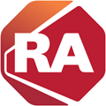

::: rau-slide-session-overview

## Session Overview

After completing this lesson, you should be able to:

* Articulate the value of this product
* Help a customer with product selection
* Complete a basic configuration of this product
* Perform a customer demonstration using existing tools
* Continue refreshing with additional resources

:::

::: rau-slide-commercial-context

## Commercial Context

::: notes

Go to the RAU Portal and Search HOTT Spot. Pick the S&C or ITD tab as needed. After 12 months some HOTT Spots move to the archived section.

:::

For background on this product, let's go to the HOTT Spot in RAU.

:::

::: rau-slide-product-overview

## Product Overview

::: notes

Good resources include the Seismic launch kit, RA customer-facing web site, HOTT Spot (if available), and GPE materials. People in the BU or Marketing may also know.

:::

Describe the product

:::

::: rau-slide-why-developed

## Why Was This Developed?

Use this slide to discuss why the product or technology was developed, what market factors drove Rockwell to implementing the solution.

:::

::: rau-slide-differentiators

## What are the Differentiators?

::: notes

Good resources include the Seismic launch kit, RA customer-facing web site, HOTT Spot (if available), and GPE materials. People in the BU or Marketing may also know.

::: script

:::

:::

* List key features
* List key features
* List key features
* List key features

:::

::: rau-slide-sell-it

## Where Can You Sell It?

::: notes

Good resources include the Seismic launch kit, RA customer-facing web site, HOTT Spot (if available), and GPE materials. People in the BU or Marketing may also know.

:::

* List target customer types
* List key industries
* Other

:::

::: rau-slide-positioning

## What is the Fit and Positioning?

* Compare to other products in the RA portfolio
* Compare to competitors (keep to generalities; details can change)
* Use selection tables to help a customer
* Use real customer sales scenarios

::: notes

Good resources include the Seismic launch kit, RA customer-facing web site, HOTT Spot (if available), and GPE materials. People in the BU or Marketing may also know.

::: script

This script section is used for the spoken-word dialogue relevant to the content and should remain plain text

:::

:::

:::

::: rau-slide-customer-demo

## How to Perform a Customer Demonstration

We will walk you through an example of a customer demonstration using the provided demo materials:

1. Find these assets in onCourse: [[TITLE]]
2. Schedule the assets.
3. Watch as we complete the demonstration steps and highlight important points.
4. Note how to find the associated documentation (steps) for reference later.

::: notes

Do a complete walk through of the configuration using the tools created by Global Portfolio Engineering. Make sure resources know where to find the VMWare in onCourse

::: script

This script section is used for the spoken-word dialogue relevant to the content and should remain plain text

:::

:::

:::

::: rau-slide-continue-learning

## Continue Learning with Additional Resources

* Launch Kits on Seismic
* HOTT Spots in the RAU Portal
* Other

:::

::: rau-slide-summary

## Summary

You should know how to:

* Articulate the value of this product
* Help a customer with product selection
* Complete a basic configuration of this product
* Perform a customer demonstration using existing tools
* Continue refreshing with additional resources

Slide Body

::: notes

Repeat the exact objectives from slide 1.

:::

:::

::: rau-slide-thank-you

# Thank You

note: Pick this slide if your printed book does not have a cover. Add trademarks as needed.

<!-- the rest of this slide should not be changed-->

::: outro-blerb

::: outro-tms

Allen-Bradley, ControlLogix, FactoryTalk, FLEX I/O Logix 5000, Integrated Architecture, Kinetix, PanelView Plus, PowerFlex, Rockwell Software, RSLinx, RSNetWorx, and Studio 5000 Logix Designer are trademarks of Rockwell Automation, Inc.  Trademarks not belonging to Rockwell Automation are property of their respective companies.

:::

::: outro-links

[[]{.logo-facebook}](https://www.facebook.com/ROKautomation) [[]{.logo-instagram}](https://www.instagram.com/ROKautomation/) [[]{.logo-linkedin}](https://www.linkedin.com/company/rockwell-automation) [[]{.logo-twitter}](https://www.twitter.com/ROKautomation) [[www.rockwellautomation.com](https://www.rockwellautomation.com)]{.ra-link}

:::

:::

:::
