# Advanced regular expressions usage

## Before You Begin {.beforeBegin}

### About this Lab {.about}

You've started experimenting with regular expressions as a way to find text using complex search terms. In this lab you will use the Replace functionality in Visual Studio Code with complex regular expressions to quickly fix common errors in Markdown text files. Advanced application of regular expressions greatly reduces *rote* text manipulation work.

In this lab, you will:

- Implement advanced regular expression syntax such as:
    - Character Repetition
    - Capture Groups
- Demonstrate all previously covered regular expression syntaxes together for complex search and replace operations

### Duration {.duration}

15 Minutes

### Materials {.materials}

This lab requires the following items. See the General Setup for more details.

1. Hardware
    - Rockwell issued computer
    - Internet access
2. Software
    - Microsoft VS Code

### Resources {.resources}

No additional resources are necessary for this lab exercise. 

## Exercise A {.exercise}

### Objectives {.objectives}

- Modify a Markdown file to have correct syntax
- Fix common editorial issues quickly

### Scenario {.scenarios}

You have converted some PowerPoint content to Markdown. The output is verbose, but doesn't have some basic things like headings and correctly spaced lists. You can manually edit the document line by line, but this would take a long time to accomplish for the entire document.

You decide to use regular expressions instead to speed up your task.

:::steps

### Practice {.practice}

It's your turn to try it:

1. Open VS Code.

1. Clone (or create a new repo from) the RAU [content-starter-pack](https://github.com/RAU-EIT/content-starter-pack) repo and open it locally on your compter.

    ::: {.rau-alert .important}

    Note

    If you completed the **Introduction to regular expressions** lab, you do not need to complete this step; continue to the next step.

    :::

1. Navigate to the **samples/skills/regex-advanced** folder and open **SFT300_FTTM_Intro.md** in VSCode.

1. Save this file as **SFT300_FTTM_Intro.fixed.md**.

1. Launch the Replace tool in VS Code by doing one of the following:

    a. Type the keyboard shortcut **Ctrl + H**
    b. Select the **Edit > Replace** menu strip option

1. In the Replace tool, click the small toggle button with the characters **[.*]** on the button face to enable search by regular expressions.

    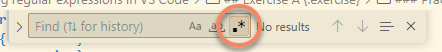

1. In this markdown file there are several lists that have empty list items, for example:

    ``` markdown
        - FTTM Setup and Configuration (Lab 05)
        - 
    ```

    Using character repetition, search for any lines that begin with a non zero amount of whitespace and end with a hyphen and space.

    Search ``^\s+-\s$``.

    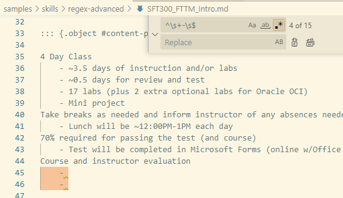

1. Leave the Replace text box empty and click **Replace all**.

1. Speaking of lists, all of the lists are incorrectly indented. The first level of a list should start at the same 'depth' (distance from the left margin) as the rest of the text it is with. Let's use ranged character repetition to look for those lists indented by four spaces. 

    Search ``\s{4}-``.

    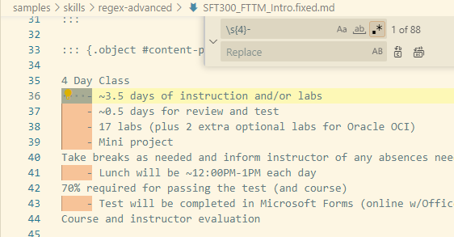

1. Type ``-`` in the Replace text box and click **Replace all**. All lists that were indented should be tight (on the left margin). 

    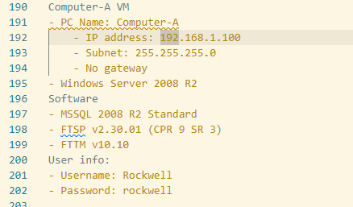

    Note on lines 192 and 193 that the further indented items maintain their correct 'depth'.

1. In a previous lesson, we search for all instances of FactoryTalk with a space in the middle. If we wanted to search for all instances of FactoryTalk with AND WITHOUT the space in the middle, we could use the optional repetition expression ``?``. If you search for ``Factory\sTalk``, you get two matches. If you search for ``Factory\s?Talk`` (making the space optional), you get 33 matches.

1. Now, we're going to use capture groups to do some tricky modifications. In markdown, lists should have blank lines before and after the list.

    This is how lists look in the Markdown file currently (which is incorrect):

    ``` markdown
    4 Day Class
    - ~3.5 days of instruction and/or labs
    - ~0.5 days for review and test
    - 17 labs (plus 2 extra optional labs for Oracle OCI)
    - Mini project
    Take breaks as needed and inform instructor of any absences needed
    - Lunch will be ~12:00PM-1PM each day
    70% required for passing the test (and course)
    - Test will be completed in Microsoft Forms (online w/Office 365 Account)
    Course and instructor evaluation
    ```

    But we want them to look like:

    ``` markdown
    4 Day Class

    - ~3.5 days of instruction and/or labs
    - ~0.5 days for review and test
    - 17 labs (plus 2 extra optional labs for Oracle OCI)
    - Mini project

    Take breaks as needed and inform instructor of any absences needed

    - Lunch will be ~12:00PM-1PM each day

    70% required for passing the test (and course)

    - Test will be completed in Microsoft Forms (online w/Office 365 Account)

    Course and instructor evaluation
    ```

    In the presentation, there was an example assuming the list items were still indented. Let's change that example to work with our current file.

    List items NOW start with the line start anchor (``^``), some amount of *optional* whitespace (``\s*?``) and a literal dash (``-``) followed by the actual list item content (``.*``) and the end of the line (``$``).

    Let's see if we can search for that item; search ``^\s*?-.*$``.

    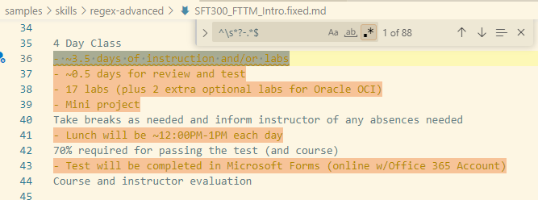

1. The above search term is good, but we need to isolate the *ending* list items. You can't use multiple start line or end line anchors in a single regular expression, but you CAN use a newline character (``\n``) to search across multiple lines.

    Let's try another search: ``^\s*?-.*\n``.

    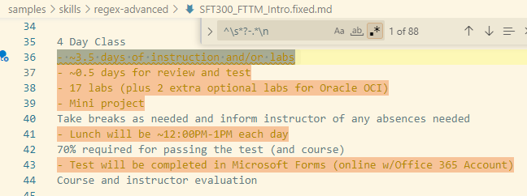

1. This looks mostly the same. But! We can search for the first character on the next line now, or search for what we don't want it to be: the start of a list. Add a negated character set for NOT a hyphen / dash at the start of the next line.

    ::: rau-input-singleline

    :::


    If you get the correct answer, you should see the following when searching:

    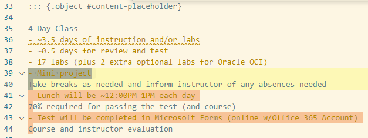

1. We are getting closer! But, there's a nasty catch for this regular expression. Go to line 192 (**Ctrl-G** and then type **192** in the box and press **Enter**).

    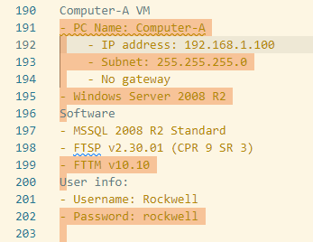

1. Indented list items are also found. We need to add whitespace to the character negation.

    Search for ``^\s*?-.*\n[^-\s]``.

    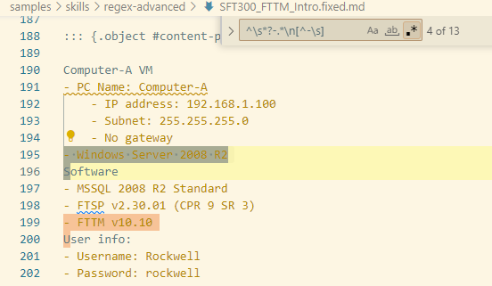

1. Our search terms are correct, so now we need to put the searched items in capture groups so that when we replace content, we can pass along the included items.

    In our example, there are two blocks of text we need to capture:

    - the spacing before the list item ``\s*?``
    - the actual list item, ``-.*?``
    - the first character we negation matched against, ``[^-\s]``

    Wrap those elements in parenthesis to 'capture' them:

    Search for ``^(\s*?)-(.*)\n([^-\s])``.

    You should have 13 matches.

1. There are three capture groups in the above regular expression. To replace that text with correct text, use the capture groups ``$1``, ``$2`` and ``$3`` in the same order in the replace, with an additional newline.

    Type in ``$1-$2\n\n$3`` in the Replace text box.

    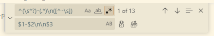

1. Click Replace (but not Replace all). You should see the first instance corrected:

    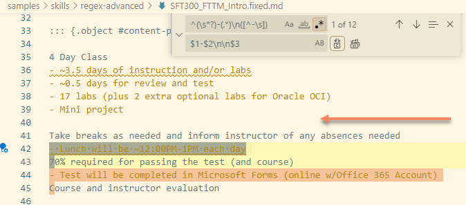

    ::: {.rau-alert .important}

    IMPORTANT

    If you made a mistake, you can undo the replace operation with **Ctrl-Z** or selecting **Edit -> Undo** from the menu strip in Visual Studio Code.

    :::

1. Let's try another quick scenario

    **END OF LAB**

:::

### Answers: Exercise A {.answers}

Check your work:

14. Adding a meta-character negation to the line after search: ``^\s*?-.*\n[^-]``