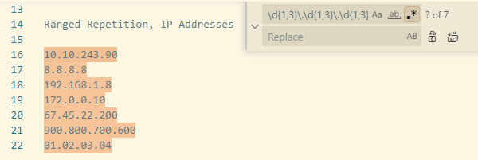
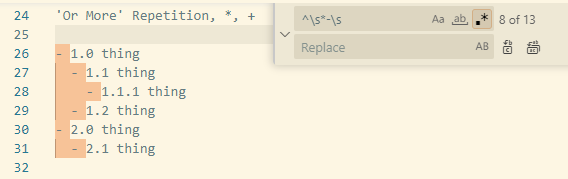
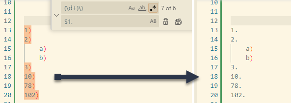

::: rau-slide-overview

## Overview

After completing this lesson, you should be able to:

- Implement advanced regular expression syntax such as:
    - Character Repetition
    - Capture Groups
- Demonstrate all previously covered regular expression syntaxes together for complex search and replace operations

:::

---

::: rau-slide-importance

## Importance of Skills

These skills are important for the following reasons:

- With complex regular expression usage, difficult text manipulation and searching becomes much easier.
- Correct application of regular expressions saves time by preventing costly manual text editing.

:::

---

## Ranged Character Repetition

Sometimes you need to look for a repeating character / sequence. If you know what the range (number of repeated characters) will be, you can use brackets:

``\d{4}``

Matches four digits in a row: **0000** - **9999**

\

``\d{2,4}``

Matches two, three or four digits in a row:

- **00-99**
- **000-999**
- **0000-9999**

--

::: rau-slide-example

### Example: Ranged Character Repetition

**Match credit card numbers:**

``\d{4} \d{4} \d{4} \d{4}``

\

**Find IP address sloppily:**

``\d{1,3}\.\d{1,3}\.\d{1,3}\.\d{1,3}``



Matches good examples, but also INCORRECT ones!

We'll fix this in a little bit!

:::

## 'or more' Repetition

These allow for 'X or more' character repetition:

``*``, **zero** or more repetitions

``+``, **one** or more repetitions

::: rau-slide-example

### Example: 'or more' Repetition

**Find any unordered lists in Markdown, regardless of 'depth'**

search: ``^\s*-\s``

``\s*`` matches any repetition of whitespace characters (including zero):



:::

## Optional Pattern

[``?``]{style="font-size:2em"}

Makes a pattern optional! Could be there, but okay if not.

\

Usually used with other repetition options (``*``, ``+``), but here's a simple example:

\

search: ``CLG?X``

Find **CLX** or **CLGX**,

*but not CLOX*

## Capture Groups

Capture groups allow you to define multiple characters, in order, as a set.

Anything within parenthesis is a group.

``(dog)+`` matches one or more repetitions of the word **dog**

\

**Capture groups are not the same as a character set!**

``[abc]``

(character set)

matches a single character: a, b or c

\

``(abc)`` 

(character sequence)

matches the sequence of characters: abc

## Why use capture groups?

Yes, you can just search for ``abc`` without a capture group,

but capture groups let you do so much more! Like:

- optional capture groups
- group substitution

### Optional Capture Groups

``(cat|dog)``

matches  *cat* OR *dog*

\

``(cat|dog)+``

matches one or more repetitions of cat or dog in any combination, e.g.

*cat, catcat, catdog, catcatdogdog, catdogcatdog*

### Using Capture Groups for Text Replacements

The COOLEST thing about capture groups is that you can refer to text in the capture group when doing REPLACE operations!

::: rau-slide-example

### Replace using capture group example

**Replace paren step numbers with dot step numbers**

search: ``(\d+)\)``

replace: ``$1.``



``(\d+)`` is the capture group: anything in that match can be used with the placeholder ``$1``

(i.e. the first capture group).

More parenthesis? ``$2``, ``$3`` ...

:::

::: rau-slide-example

### Another replace using capture group example

**Change quote styles in a document**

search: ``^(\w+):(.*)$``

replace: ``<$1> $2``

::: columns

::: column

**Before**

Tom: I'll get you!

Jerry: I don't think so!

:::

::: column

**After**

\<Tom\> I'll get you!

\<Jerry\> I don't think so!

:::

:::

:::

::: rau-slide-example

### Create trailing blank line after list example

Consider the following markdown:

``` markdown
4 Day Class

    - ~3.5 days of instruction and/or labs
    - ~0.5 days for review and test
    - 17 labs (plus 2 extra optional labs for Oracle OCI)
    - Mini project
Take breaks as needed and inform instructor of any absences needed

    - Lunch will be ~12:00PM-1PM each day
```

and after

``` markdown
4 Day Class

    - ~3.5 days of instruction and/or labs
    - ~0.5 days for review and test
    - 17 labs (plus 2 extra optional labs for Oracle OCI)
    - Mini project

Take breaks as needed and inform instructor of any absences needed

    - Lunch will be ~12:00PM-1PM each day
```

### Basic regex example application

This regex uses two pattern groups. They are numbered in the order they occur in the regex.

search: ``\s\s\s\s-\s(.*)\n^([^\s\n])``
\
replace: ``    - $1\n\n$2``

### Better regex example application

Again, more accurate matching for any (or no) indentation, that preserves indentation:

search: ``(\s*?)-\s(.*)\n^([^\s\n])``
\
replace: ``$1- $2\n\n$3``

:::

::: rau-slide-summary

## Summary

You should know how to:

- Implement advanced regular expression syntax such as:
    - Character Repetition
    - Capture Groups
- Demonstrate all previously covered regular expression syntaxes together for complex search and replace operations

:::

::: rau-slide-thank-you

## Thank You

note: Pick this slide if your printed book does not have a cover. Add trademarks as needed.

<!-- the rest of this slide should not be changed-->

::: outro-blerb

::: outro-tms

Allen-Bradley, ControlLogix, FactoryTalk, FLEX I/O Logix 5000, Integrated Architecture, Kinetix, PanelView Plus, PowerFlex, Rockwell Software, RSLinx, RSNetWorx, and Studio 5000 Logix Designer are trademarks of Rockwell Automation, Inc.  Trademarks not belonging to Rockwell Automation are property of their respective companies.

:::

::: outro-links

[[]{.logo-facebook}](https://www.facebook.com/ROKautomation) [[]{.logo-instagram}](https://www.instagram.com/ROKautomation/) [[]{.logo-linkedin}](https://www.linkedin.com/company/rockwell-automation) [[]{.logo-twitter}](https://www.twitter.com/ROKautomation) [[www.rockwellautomation.com](https://www.rockwellautomation.com)]{.ra-link}

:::

:::

:::
