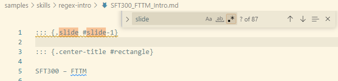
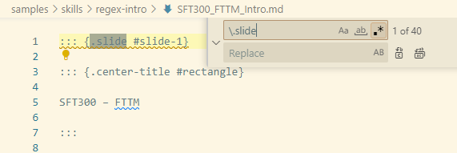
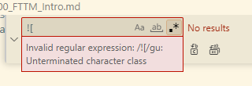
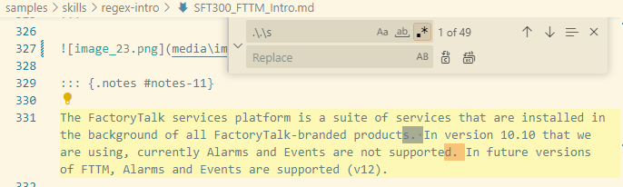
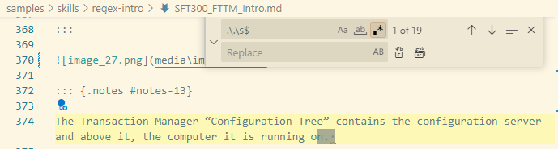

# Basic regular expression usage

## Before You Begin {.beforeBegin}

### About this Lab {.about}

Regular expressions are a powerful tool to search and modify text in documents. Having basic understanding of regular expressions can speed up menial text modification tasks.

In this lab, you will:

- Practice and implement regular expression solutions
    - Literal strings
    - Escaped characters
    - Anchors
    - Meta-characters

### Duration {.duration}

15 Minutes

### Materials {.materials}

This lab requires the following items. See the General Setup for more details.

1. Hardware
    - Rockwell issued computer
    - Internet access
2. Software
    - Microsoft VS Code

### Resources {.resources}

You will need the sample text file ``sample-regex-basics.txt`` to complete the lab.

## Exercise A {.exercise}

### Objectives {.objectives}

- Enable regular expressions in VS Code
- Test a basic regular expression find and replace

### Scenario {.scenarios}

You have converted some PowerPoint content to Markdown. The output has everything from the original PowerPoint, but there are many editorial corrections that need to be made.

You decide to use regular expressions instead to speed up your task.

::: steps

### Practice {.practice}

It's your turn to try it:

1. Open VS Code.

1. Clone (or create a new repo from) the RAU [content-starter-pack](https://github.com/RAU-EIT/content-starter-pack) repo and open it locally on your compter.

    ::: {.rau-alert .important}

    Note

    If you completed the **Regular Expressions Introduction** lab, you do not need to complete this step; continue to the next step.

    :::

1. Navigate to the **samples/skills/regex-basics** folder and open **SFT300_FTTM_Intro.md** in VSCode.

1. Let's review literal string searches. This is a conversion of a PowerPoint, so it's made up of slides.*How many slides are in this document?* In this document, search (Ctrl + F) for the number of slides in the document. Search ``[slide]``.

    

    There are 87 hits on the search. Many of them are duplicates though, and we can build a more accurate search.

1. Looking at the results from the previous search, slides look like this:

    ``` markdown
    ::: {.slide #slide-1}
    ```

    If you try to search for ``.slide``, you still get many (80) responses, including the ``#slide`` texts. 

    Period (``.``) is a special meta-character in regular expressions. To search for a literal period we need to *escape* the period before the word slide instead. Search ``\.slide``.

    You should see 40 matches.

    

1. There are other meta-characters for digits, common characters in words and whitespace. If you wanted to search for slides with their number, you can do that using the search ``slide-\d``. You should see 40 results. How would you only search for slides with two numbers in the slide identifier?

    ::: rau-input-singleline

    :::

1. Let's say you needed to search for any (incorrectly) branded references to **Factory Talk**. What would you search for?

    ::: rau-input-singleline

    :::

1. You've been asked to find all references to images in this markdown document. For reference, any images are written in markdown as ````.  Try to search for ``![``.

    

    The search box says this is an invalid regular expression; the open and close square brackets are used for custom meta-characters. How would you *escape* the opening square bracket to search for all image references?

    ::: rau-input-singleline

    :::

1. Man, the requests keep coming! Now you've been asked to find all the paragraphs / single lines of text that have a space AFTER the period. You *could* search for any character (``.``) followed by an ACTUAL period (``\.``) and then ending with a space (``\s``). Search ``.\.\s``.

    The first match is in the middle of a paragraph, which isn't correct. 

    

    You need a way to search with regular expressions for the a space *at the end* of the line. An *anchor*.

1. Change your search to ``.\.\s$``. ``$`` is the end of line anchor. You should get 19 results, and they look better.

    

1. For some reason, all the first level lists that were converted to Markdown are incorrectly indented. They look like this:

    ``` markdown
    **Transaction Control Manager Service** 
        - The Transaction Control Manager is a service that controls and executes transactions with the additional functionality of the FactoryTalk Live Data control connector embedded in it. 
    ```

    But they should look like this:

    ``` markdown
    **Transaction Control Manager Service** 
    - The Transaction Control Manager is a service that controls and executes transactions with the additional functionality of the FactoryTalk Live Data control connector embedded in it. 
    ```

    We're not going to fix them right now (but we will in the next lesson), but we can at least *find* them.

    Each list item is indented by **four spaces** and has a hyphen as the list marker. How would you search for lines that begin with four spaces and a list marker?

    ::: rau-input-singleline

    :::

1. This Markdown conversion, bless its heart, also has many abbreviated Rockwell product references. For example, FactoryTalk Services Platform is mentioned as FTSP and FactoryTalk Transaction Manager is FTTM.

    If you wanted to search and find references to both products in their acronym form with a single search, you can build a custom meta-character!

    Find any references to FTSP or FTTM in a single search. Search for ``FT[ST][PM]``.

1. How would you change this search to also look for FactoryTalk Alarm and Events (FTAE) and FactoryTalk Live Data (FTLD)?

    ::: rau-input-singleline

    :::


1. Custom-metacharacters can also be negated using the caret ``^``. Maybe the author just abbreviated FactoryTalk by itself as FT. If you wanted to look for any references to the characters *FT* together that were not in another common word like *soFTware* or *MicrosoFT*, you can search for ``[^o]FT[^TSw]``.

**END OF LAB**

:::

### Answers: Exercise A {.answers}

Check your work:

6. Search for slides IDs with two digits: ``slide-\d\d``

\

7. Search for instances of incorrectly branded **Factory Talk**: ``Factory\sTalk``

\

11. Search for incorrectly indented list items: ``^\s\s\s\s-``

\

13. Find references to several FactoryTalk products together: ``FT[STAL][PMED]``
