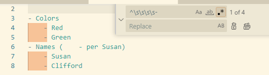

::: rau-slide-overview

## Overview

After completing this lesson, you should be able to:

- Implement basic regular expression syntax such as:
    - Literal strings
    - Escaped characters
    - Anchors
    - Meta-characters

:::

::: rau-slide-importance

## Importance of Skills

These skills are important for the following reasons:

- Basic regular expression syntax is the foundation of meaningful complex regular expressions that can quickly solve difficult problems in text manipulation.
- Correct application of regular expressions saves time by preventing costly manual text editing.

:::

::: rau-slide-example

## Literal Strings

Searching for specific words or character patterns

``rockwell``

``1756``

Mostly trivial; could be done with basic find / replace.

Has one major caveat!

:::

### Searching for special characters

Regular expressions use MANY special characters (mostly punctuation) to MEAN something about the pattern or text. Such as:

::: {style="font-size:.7em;"}

| Character | Name | Meaning |
|:----:|:----------|:----|
| ``.`` | (dot) | meta-character, matches anything |
| ``(``, ``)`` | (parenthesis) | subgroup capture |
|  ``{`` , ``}`` | (curly bracket) | repetition iterator |
| ``\`` , ``/`` | (slashes) | escape characters |
| ``[`` , ``]`` | (bracket) | custom metacharacter set |
| ``^`` | (caret) | line beginning anchor or negation mark) |
| ``$`` | (dollar sign) | line end anchor |
| ``+`` | (plus) | 1 or more repetitions |
| ``*`` | (asterisk) | 0 or more repetitions |
| ``?`` | (question mark) | optional match |
| | I dunno | and probably others I've forgotten |

:::

### Escaping special characters

Because those characters are special, literal searches for them must be ESCAPED.

\

search: ``192.168.1.1`` ?

\

NOOOOOOOO

\

search ``192\.168\.1\.1``

\

``\`` 'escapes' the standard regex parser

::: rau-slide-question

## Question

How do you search for something with a slash then?

search: ``\log.txt``

[**ANSWER**]{.fragment style="font-size:1.5em"}

[search: ``\\log.txt``]{.fragment}

:::

## Anchors

Search for things that are 'anchored' by the start or end of a line

- ``^``, Beginning of line
- ``$``, end of line

\

**Examples**

- ``^1\.``,  first step of a sequence
- ``\!$``, sentences of exclamation

::: rau-slide-question

## Question

How would you find list items (``-``) that are inset by exactly four spaces?

``` markdown
- Colors
    - Red
    - Green
- Names (    - per Susan)
    - Susan
    - Clifford
```

search: ???

:::

::: rau-slide-question

## Question

How would you find list items (``-``) that are inset by exactly four spaces?


``` markdown
- Colors
    - Red
    - Green
- Names (    - per Susan)
    - Susan
    - Clifford
```

search: ``\s\s\s\s-``

::: fragment


Oh no! Extra match on line 6!

:::

:::

::: rau-slide-question

## Question

How would you find list items (``-``) that are inset by exactly four spaces?


``` markdown
- Colors
    - Red
    - Green
- Names (    - per Susan)
    - Susan
    - Clifford
```

**Now with anchors!**

search: ``^\s\s\s\s-``

::: fragment



Success!

:::

:::

## Meta-characters

Matches 'types' of characters

Makes for clean searches of certain character types

\

| Character | Character Type | Example |
|:----:|:--------:|:-------:|
|``\d``| digits | 0-9 |
|``\w``| word | a-z, A-Z, 0-9, _ |
|``\s`` | whitespace | space, tab |

::: rau-slide-example

## Example: Meta-characters

Find incorrectly branded references to FactoryTalk:

search: ``Factory\sTalk``

\

Find all references to British agents:

search: ``00\d``

\

Find specific ControlLogix DC modules:

search: ``17\d\d-\sB``

:::

### Negation of Meta-characters

Matches anything NOT in the character set

\

| Character | Character Type |
|:----:|:--------:|
|``\D``| NOT digits |
|``\W``| NOT word |
|``\S``| NOT whitespace |

## Custom meta-character sets

- ``[abc]``	Only a, b, or c
- ``[a-z]``	Characters a to z
- ``[0-9]``	Numbers 0 to 9

These examples match one character.

\

To match multiple characters, you need one pattern per character:

``[abc][123]``

::: rau-slide-example

## Example: Custom meta-characters

Find references to FactoryTalk View ME and SE:

search: ``FactoryTalk\sView\s[MS]E``

\

Find references to British agent 007 and 009:

search: ``00[79]``

\

Find more specific ControlLogix DC modules:

search: ``17[56]\d-[IO][AB]``


:::

::: rau-slide-question

## Question

Which IP addresses will this regex pattern match on?

search: ``192\.168\.[15]\.[78][24]``

\

::: fragment

| 192.168.1 range | 192.168.5 range |
|--- |--- |
| 192.168.1.72 | 192.168.5.72 |
| 192.168.1.74 | 192.168.5.74 |
| 192.168.1.82 | 192.168.5.82 |
| 192.168.1.84 | 192.168.5.84 |

:::

:::

### Custom meta-character set negation

``[^abc]``

Not a, b, nor c

::: rau-slide-example

## Example: Custom meta-character set negation

Find Rockwell processors that are NOT ControlLogix or CompactLogix:

search: ``17[^56]-[OI][AB]``


:::

## Wildcard meta-character

The almighty dot!

\

``.``

\

It matches

\

[ANY]{.fragment}

\

[SINGLE]{.fragment}

\

::: fragment

CHARACTER

\

**This can be reckless and make false positive matches; use with caution!**

:::

::: rau-slide-example

## Example: Wildcard meta-character

Find all Rockwell controller products:

search: ``17..-``

::: fragment


:::

::: fragment


:::

::: notes

The dot 'overmatches' here - it matches things that aren't correct. It's a character, but we would be better off matching a more specific character set.

::: script

:::

:::


:::

::: rau-slide-summary

## Summary

You should know how to:

- Implement basic regular expression syntax such as:
    - Literal strings
    - Escaped characters
    - Anchors
    - Meta-characters

:::

::: rau-slide-thank-you

## Thank You

<!-- the rest of this slide should not be changed-->

::: outro-blerb

::: outro-tms

Allen-Bradley, ControlLogix, FactoryTalk, FLEX I/O Logix 5000, Integrated Architecture, Kinetix, PanelView Plus, PowerFlex, Rockwell Software, RSLinx, RSNetWorx, and Studio 5000 Logix Designer are trademarks of Rockwell Automation, Inc.  Trademarks not belonging to Rockwell Automation are property of their respective companies.

:::

::: outro-links

[[]{.logo-facebook}](https://www.facebook.com/ROKautomation) [[]{.logo-instagram}](https://www.instagram.com/ROKautomation/) [[]{.logo-linkedin}](https://www.linkedin.com/company/rockwell-automation) [[]{.logo-twitter}](https://www.twitter.com/ROKautomation) [[www.rockwellautomation.com](https://www.rockwellautomation.com)]{.ra-link}

:::

:::

:::
