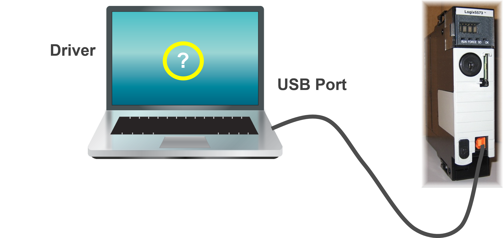

## SCORM / E-Learning Objects Test

This document demonstrates the syntax and functionality of the interactive objects that can be built into SCORM content.

These objects can be easily inserted into markdown using the vscode 'code snippets' functionality: **Ctrl+Space** brings up the snippet selector, and from there you can type 'rau' to see a list of the objects available.  

## The Image Hotspot Object

The image hotspot allows you to put notes on a graphic to call attention to certain parts of the image. Use percentages to 'place' the spot on the image. Keep hotspot notes short for impact.

::: rau-image-hotspot


::: {.rau-hotspot .up .right xpos=10 ypos=10}

### Spot Title

Spot details

:::

::: {.rau-hotspot .down xpos=30 ypos=30}

### Spot Title

Spot details

:::

:::


::: rau-contentdivider
:::

## The Accordion Object

The accordion object allows for blocks of content to be presented in collapsed (but expandable) containers. In print, this object shows all containers expanded, and tries to not page break in the middle of a block if possible.

Accordion objects are wrapped up in a fenced div with the class **rau-accordion**. Each collapsible section is in a **tab** div.

The first element of each tab should be an object (paragraph or header) that can be used as the title. If the first thing in the **tab** is soamething else, like an image or link, then the **tab**'s title will be set to 'Tab with no Title'.

Here's the markdown for the object.

::: rau-accordion

::: tab

### Section 1

Section 1 Content


:::

::: tab

### Section 2, going farther

#### Sub Header

* Do a thing with this code, then do another thing.
* We can do all the things.
* More things more of the time.

#### Another Header

Can this actually work?!?

:::

::: tab

### Section 3, wall of text

This is the thing that we have to do. We have to do a thing.
There are a lot of things that we *could* do, but this is
the thing that we **HAVE** to do. Blah blah blah, green eggs
and ham, la li lu le lo.

:::

:::

::: rau-contentdivider
:::


## Process Steps Object

The process steps object shows a set of information or steps. Note that this view looks different based on the docType. Change the docType option in this document's front matter to 'lab' and re-run the preview to see the output change to the 'Practice' section of a lab document!

::: rau-steps

::: tab

### Introduction

Write an intro for what these steps are going to do.

This introduction tab is optional and can be deleted.


:::

::: tab

### Step 1 Title

Step Details go here. This can contain many paragraphs, images or tables. Go wild!

:::

::: tab

### Step 2 Title

Step Details go here. This can contain many paragraphs, images or tables. Go wild!

:::

::: tab

### Step 3 Title

Step Details go here. This can contain many paragraphs, images or tables. Go wild!

:::

::: tab

### Summary

This is a recap of the things that were covered in this Steps object. This summary tab is optional and can be deleted.

:::

:::

::: rau-contentdivider
:::

## The Flipcards Object

The flipcards object is a good visual way to display a set of definitions or other short concepts.

::: rau-flipcards

| front | back |
|---|---|
| Front of card 1 | Back of card 1 |
| Front of card 2 |  |
| Front of card 3 | Back of card 3 |

:::

## The Sorting Cards Object

The sorting cards object is a good way to verify concepts and categories. This should be an object that is used AFTER you've defined the initial terms and concepts somewhere else earlier in the material.

::: rau-sortingcards

### Activity Title

Any information to help the student understand what to do

::: rau-sortcardlist

* Category1
  * Card Text 1
  * Card Text 2
  * 
* Category2
  * Card Text 3
  * Card Text 4
* Category3
  * Card Text 5

:::

:::

::: rau-contentdivider
:::

::: rau-quiz

``` markdown

### Single Answer Question Title

> this is a hint for a question

1. [ ] Ans 1
1. [x] Ans 2
1. [ ] Ans 3
1. [ ] Ans 4

### Multiple Answer Question Title

> Answers 1 and 2 are correct

- [x] Ans 1
- [x] Ans 2
- [ ] Ans 3
- [ ] Ans 4

### Sequence Question Title

> Reverse Order

1. D
2. C
3. B
4. A

```

:::
