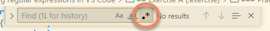
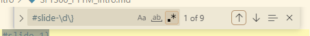
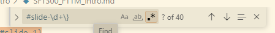
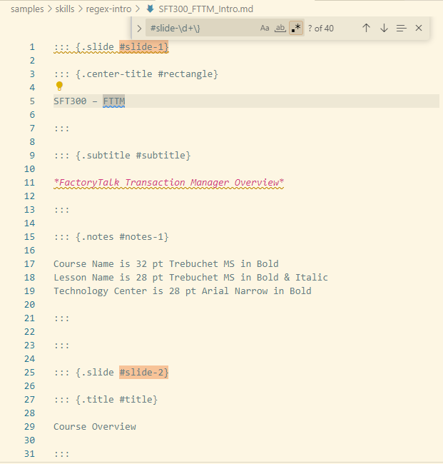
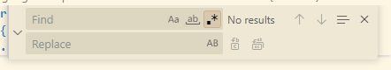
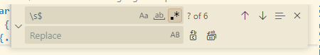

# Introduction to Regular expressions

## Before You Begin {.beforeBegin}

### About this Lab {.about}

Regular expressions are a powerful tool to search and modify text in documents. Having basic understanding of regular expressions can speed up menial text modification tasks.

In this lab, you will:

- Enable regular expression searches in VS Code
- Test a basic regular expression find and replace

### Duration {.duration}

5 Minutes

### Materials {.materials}

This lab requires the following items. See the General Setup for more details.

1. Hardware
    - Rockwell issued computer
    - Internet access
2. Software
    - Microsoft VS Code

### Resources {.resources}

No additional resources are necessary for this lab exercise. 

## Exercise A {.exercise}

### Objectives {.objectives}

- Enable regular expressions in VS Code
- Test a basic regular expression find and replace

### Scenario {.scenarios}

You have converted some PowerPoint content to Markdown. The output is verbose, but doesn't have some basic things like headings and correctly spaced lists. You can manually edit the document line by line, but this would take a long time to accomplish for the entire document. 

You decide to use regular expressions instead to speed up your task. 

:::steps

### Practice {.practice}

It's your turn to try it:

1. Open VS Code.

1. Clone (or create a new repo from) the RAU [content-starter-pack](https://github.com/RAU-EIT/content-starter-pack) repo and open it locally.

1. Navigate to the **samples/skills/regex-intro** folder and open **SFT300_FTTM_Intro.md**.

1. Launch the Find tool in VS Code by doing one of the following:

    a. Type the keyboard shortcut **Ctrl + F**
    b. Select the **Edit > Find** menu strip option

1. In the Find tool, click the small toggle button with the characters **[.*]** on the button face.

    

1. The document you have opened is an export of a PowerPoint document to Markdown. Each PowerPoint slide is represented in Markdown as follows:

    ```markdown
    ::: {.slide #slide-1}

    ~slide content~

    :::
    ```

    If we want to know how many slides there are in the document, we can use a regular expression to search for each slide.

1. Type this regex into the search bar: ``#slide-\d\}``

    

    You should see nine matches. If you scroll down through the document, there are MANY more than nine slides. 

1. Change your regex to this: ``#slide-\d+\}``

    You should now see 40 matches now.

    

    Also, note that the matches are highlighted in the editor view. 

    

1. Now let's use the replace tool. Do one of the following:

    a. Type the keyboard shortcut **Ctrl + H**
    b. Select the **Edit > Replace** menu strip option

    

1. I am terrible about adding a space at the end of a line as I'm typing. I've probably done it here as well. Let's fix my mistakes. 

    Put the following in the Find text box: ``\s$``

    Leave the Replace text box empty.

    

1. Click the Replace button to go to the next occurrence. Click the Replace button again to replace multiple occurrences, or click Replace all.

1. Don't worry about understanding the regular expressions you've seen here so far; we're going to talk about how they work in the next lesson!

    **END OF LAB**

:::
