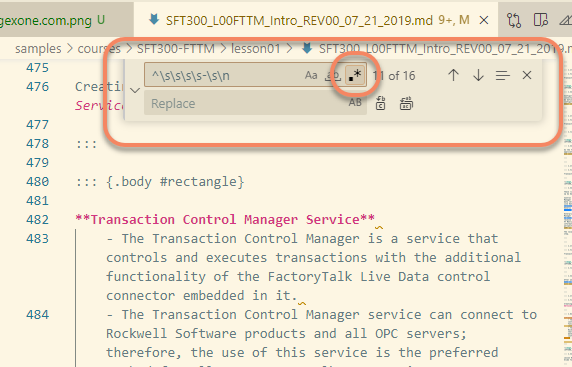

::: rau-slide-overview

## Overview 

After completing this lesson, you should be able to:

- Define regular expressions
- Identify common resources for testing regular expressions

:::

::: rau-slide-importance

## Importance of Skills

These skills are important for the following reasons:

- Regular expressions are a powerful tool for manipulating text in ways that basic search and replace cannot accomplish
    - Searching across multiple lines
    - Matching 'sets' of characters
    - Replacing with text found within the search term
- Markdown is clear text, which makes regular expressions the PREMIER way to search and replace
- Regular expressions are cool
- Don't you want to be cool? All the cool kids are doing it!

:::

::: rau-slide-example

## Example

::: columns

::: column

**Before**

``` markdown
::: {.title #title}

Course Overview

:::
```

:::

::: column

**After**

``` markdown
## Course Overview
```

:::

:::

And the regular expression?

search: ``::: \{.title #title\}[\n]+(.*)[\n]+:::``

replace: ``## $1``

::: callout

*Don't worry, this is an advanced regex!*

:::

:::

::: rau-slide-definition

## Definition

A **regular expression** is a sequence of characters that represent a pattern to match in text.

\

A few basic examples:

| Regular expression | Description |
|:----|:------------|
| ``^\d+$`` | Positive integers: ``4``, ``309``, etc |
| ``^-\d+$`` | Negative integers: ``-4``, ``-309``, etc |
| ``^\w+\s\w+$`` | Two word line: ``hello world``, ``high five`` |
| ``\w+ball`` | Any occurrence of ``*ball``: e.g. ``football``, ``baseball``, ``handball`` |

:::

::: rau-slide-chalktalk

## History

- 1951, Stephen Cole Kleene created a mathematical notation to describe regular languages (in math) called *regular events*.
- 1968, Ken Thompson (of Bell Labs, UNIX fame) implemented Kleene's notation into text editor QED to match patterns in text files.
- 1970s, Additional UNIX tools implement original regex forms, ``awk, expr, lex, sed``.
- 1980s, Perl / TCL programming languages implement *Advanced Regular Expressions*.
- 1997, [PCRE](https://en.wikipedia.org/wiki/Perl_Compatible_Regular_Expressions) (Perl Compatible Regular Expressions) is implemented for PHP.

::: callout

**PCRE is the general standard for Regular Expressions today.**

:::

:::

::: rau-slide-multimedia

## Resources Available

Regular expressions are in most programming languages.

Resources are EVERYWHERE!

Be careful what you paste into a textbox online!

Test sensitive content locally (in VScode)

::: notes

Emphasize being careful with Rockwell IP on websites!

::: script

Because Regular Expressions are implemented in most high level programming languages there are endless resources online to use.

With any online resources that you can use to test regular expressions, please be careful about what you paste into a text box!

If you are working with sensitive information, for example, things classified as internal or higher, do your testing locally in VScode instead of pasting that information into a textbox on a website. Information submitted to websites can be saved unknowingly to the end user.

:::

:::

:::

### [regex101.com](https://www.regex101.com)

Great for troubleshooting a regular expression you're working on

Shows you the matches and breaks down your regex string


### [regexone.com](https://www.regexone.com)

Step by Step Tutorial with Exercises


## Microsoft Documentation

A little dry on flavor, but filling

- [VScode find and replace tool](https://code.visualstudio.com/docs/editor/codebasics#_find-and-replace)
- [Use regular expressions in Visual Studio](https://learn.microsoft.com/en-us/visualstudio/ide/using-regular-expressions-in-visual-studio?view=vs-2022)

\

**Using the Find / Replace tool in VScode:**



::: rau-slide-demo

## When do I use regexes?

Regular expressions are commonly used for things like:

- Validating pattern matching, *Does your password meet complexity requirements?*
- Search and replace in text
- Standardizing whitespace
- Parsing user input, *Is the phone number in the correct format?*
- Parsing debug logs

:::

::: rau-slide-question

## Question

**You're working on replacing lots of text in a document that is classified as Restricted access. You know you need to use a regular expression to do the search and replace, but you are having trouble getting it right. What should you do?**

a) Ask your friend that works at Google. He probably knows regular expressions!
b) Test your regex locally on your work PC in VScode.
c) Post a question to StackOverflow with the data you are trying to parse.
d) Use regex101.com's interactive tester with your document text and your test regex.

::: notes

Answers:

B is the only correct answer! Don't leak info through 'convenient' online platforms.

:::

:::

::: rau-slide-summary

## Summary

You should know how to:

- Define regular expressions
- Identify common resources for testing regular expressions

:::

::: rau-slide-thank-you

## Thank You

<!-- the rest of this slide should not be changed-->

::: outro-blerb

::: outro-tms

Allen-Bradley, ControlLogix, FactoryTalk, FLEX I/O Logix 5000, Integrated Architecture, Kinetix, PanelView Plus, PowerFlex, Rockwell Software, RSLinx, RSNetWorx, and Studio 5000 Logix Designer are trademarks of Rockwell Automation, Inc.  Trademarks not belonging to Rockwell Automation are property of their respective companies.

:::

::: outro-links

[[]{.logo-facebook}](https://www.facebook.com/ROKautomation) [[]{.logo-instagram}](https://www.instagram.com/ROKautomation/) [[]{.logo-linkedin}](https://www.linkedin.com/company/rockwell-automation) [[]{.logo-twitter}](https://www.twitter.com/ROKautomation) [[www.rockwellautomation.com](https://www.rockwellautomation.com)]{.ra-link}

:::

:::

:::
